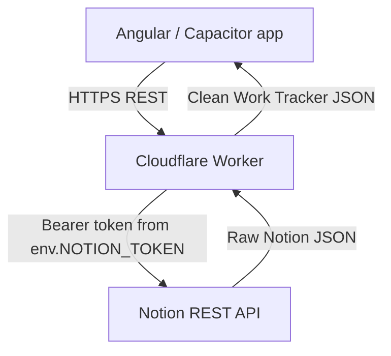

# What is a Cloudflare Worker?

A Cloudflare Worker is a serverless execution environment for running JavaScript or TypeScript on Cloudflare's network. Instead of provisioning a traditional server, the developer writes request-handling code and Cloudflare runs it when HTTP requests arrive.

## Serverless

Serverless does not mean there are no servers. It means this project does not manage a traditional VM, operating system, Node server process, reverse proxy, patching schedule, or long-running application host.

The project supplies application code. Cloudflare supplies the runtime, deployment target, scaling behavior, and request entry point.

## Request Lifecycle

```text
HTTP request
    ->
Worker fetch(request, env, ctx)
    ->
application logic
    ->
optional external service call
    ->
Response
```

In this repository, the Worker receives app requests, optionally calls the Notion REST API, maps raw Notion JSON into cleaner JSON, and returns a native `Response`.

## Exported Fetch Handler

Cloudflare calls the default export's `fetch` method for HTTP requests:

```ts
export default {
  async fetch(request, env, ctx) {
    // application logic
    return new Response("ok");
  }
}
```

The parameters are:

| Parameter | Meaning |
| --- | --- |
| `request` | The incoming HTTP request, including method, URL, headers, and body. |
| `env` | Cloudflare bindings for this Worker, such as variables and secrets. |
| `ctx` | Execution context for lifecycle features such as background work with `waitUntil`. |
| `Response` | The Web Fetch API response object returned to the caller. |

This project uses `Response.json(...)` to return JSON responses.

## Worker and Backend

A backend is a responsibility or layer.

A Worker is a runtime or platform.

A Worker can host backend code. In this project, the Worker is the backend/API layer for the Work Tracker app.

## What a Worker Backend Can Do

A Worker backend can reasonably handle:

- REST APIs
- authentication
- authorization
- input validation
- database access
- external API calls
- caching
- business logic
- response transformation
- webhooks

## What This Project Is Not Using

This repository is not currently using:

- traditional Express server
- dedicated Node server
- VM
- Docker server
- database hosted inside this project

Notion is the external data store. The Worker is the API layer in front of it.

## Why Workers Fit This Project

Cloudflare Workers are suitable for this personal Work Tracker because the backend is currently lightweight, request-driven, and mostly proxying and transforming Notion data. The Worker keeps the Notion token out of the Angular/Capacitor app while leaving room for future server-side filtering, validation, caching, authentication, and write APIs.



## Related Docs

- [Project Creation](02-project-creation.md)
- [Worker as API Proxy](04-worker-as-api-proxy.md)
- [Security](07-security.md)
