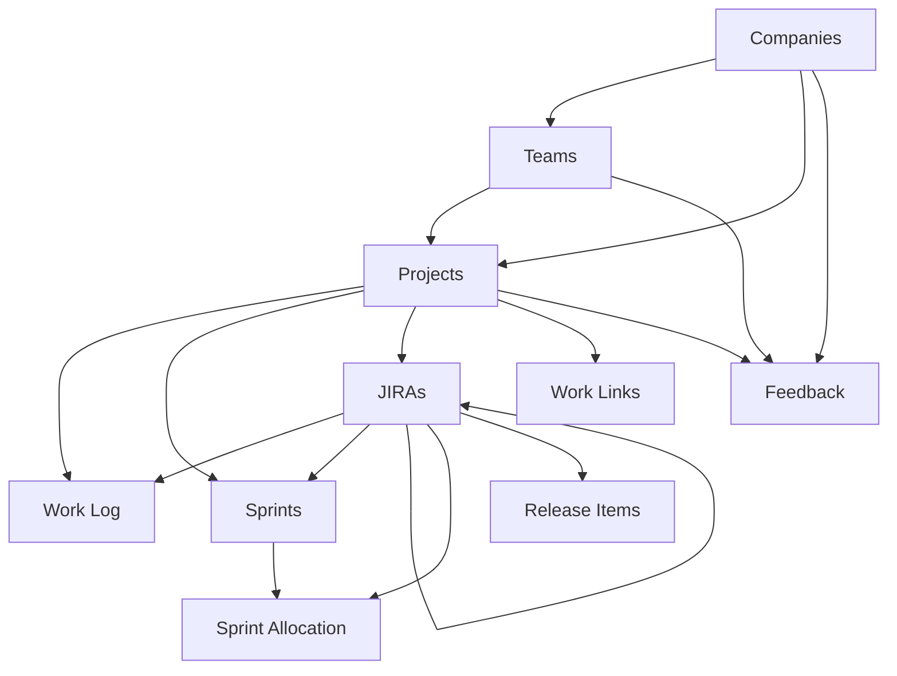

# Work Tracker — Notion Database Schema Reference

**Version:** 2026-09-02  
**Purpose:** Reference schema for the Notion-based Work Tracker used for daily work updates, feedback/growth tracking, sprint/JIRA tracking, appraisal notes, dependencies, demo tracking, release-item tracking, links, and bandwidth planning.

---

## 1. High-level model



### Source-of-truth rule

Each database owns only the data that belongs to it.

- **Companies** owns organization metadata.
- **Teams** owns team metadata.
- **Projects** owns project metadata and active/inactive state.
- **Work Log** owns day-to-day activity entries.
- **Sprints** owns sprint dates and capacity/bandwidth.
- **JIRAs** owns Jira ticket metadata and sprint history.
- **Sprint Allocation** owns the planned number of days for one Jira in one sprint.
- **Work Links** owns reusable office/project links.
- **Release Items** owns component/version-level release records for JIRAs; one JIRA may have multiple release items.
- **Feedback** owns received feedback, its source/context, organization scope, details, and follow-up action.

Derived values should be implemented with **Rollups** or **Formulas**, not manually duplicated.

---

# 2. Companies

## Purpose

Stores companies/clients and optional organization metadata.

## Properties

| Property | Notion type | Required | Notes |
|---|---|---:|---|
| `Company` | Title | Yes | Company/client name. Example: `Clarivate` |
| `Category` | Select | Yes | Typical values: `Office Work`, `Freelancing` |
| `Division` | Text | No | Example: `Life Sciences & Healthcare (LS&H)` |
| `Product` | Text | No | Example: `Cortellis` |
| `Projects` | Relation | Derived | Reverse relation from `Projects.Company` |
| `Teams` | Relation | Derived | Reverse relation from `Teams.Company` |
| `Active` | Checkbox | Yes | Whether this company/client is currently active |

## Relations

- `Companies 1 ─── * Teams`
- `Companies 1 ─── * Projects`

`Projects` and `Teams` are useful reverse relations here because Company is the organization root.

---

# 3. Teams

## Purpose

Stores teams under a company.

## Properties

| Property | Notion type | Required | Notes |
|---|---|---:|---|
| `Team` | Title | Yes | Example: `Jupiter (Cortellis Team 1)` |
| `Company` | Relation → Companies | Yes | Limit: 1 page; two-way relation ON |
| `Projects` | Relation | Derived | Reverse relation from `Projects.Team` |
| `Active` | Checkbox | Yes | Current/active team |

## Relations

- `Teams * ─── 1 Companies`
- `Teams 1 ─── * Projects`

---

# 4. Projects

## Purpose

Keeps the project list intentionally small and clean. When an old project is no longer used, uncheck `Active`.

## Properties

| Property | Notion type | Required | Notes |
|---|---|---:|---|
| `Project` | Title | Yes | Example: `Cortellis Regulatory Intelligence (CRI)` |
| `Company` | Relation → Companies | Yes | Limit: 1 page; two-way ON to `Companies.Projects` |
| `Team` | Relation → Teams | No | Limit: 1 page; two-way ON to `Teams.Projects` |
| `Active` | Checkbox | Yes | Only current/active projects remain checked |

## Deliberately NOT stored here

Do **not** keep reverse lists of:

- JIRAs
- Sprints
- Work Logs

Those records can be queried from their own databases when needed.

---

# 5. Work Log

## Purpose

Daily work journal. One Jira can have many Work Log entries across multiple dates.

A Work Log entry may also have **no Jira**, for example:

- meetings,
- mentoring,
- knowledge transfer,
- learning/grooming,
- support,
- planning,
- appraisal-worthy non-Jira work.

## Properties

| Property | Notion type | Required | Source |
|---|---|---:|---|
| `Update` | Title | Yes | Manual |
| `Date` | Date | Yes | Template default = `Today` (date when duplicated); editable |
| `Category` | Select | Yes | Manual |
| `Project` | Relation → Projects | No | Manual |
| `Company` | Rollup | No | `Project → Company` |
| `Team` | Rollup | No | `Project → Team` |
| `Type` | Select | Yes | Manual |
| `JIRAs` | Relation → JIRAs | No | Manual; no limit; one-way |
| `Jira Status` | Rollup | No | `JIRAs → Status`, show unique/original |
| `Sprints` | Rollup | No | `JIRAs → Sprints`, show unique/original |
| `Spillover Count` | Rollup | No | `JIRAs → Spillover Count` |
| `Comment` | Text | No | Detailed daily update |
| `Went Wrong` | Text | No | Fill only when something did not go well |
| `Work Mode` | Select | No | Default via template = `WFO (Office)` |
| `Appraisal` | Checkbox | No | Important work to quote during appraisal |

## Category options

Recommended:

- `Office Work`
- `Freelancing`
- `Grooming`

## Type options

Current/known options include:

- `Work`
- `Meeting`
- `Issue`
- `Learning`
- `Planning`
- `Review`
- `Review & Analysis`
- `Support`
- `Inter-team work`
- `Workshop`
- `Mentoring`
- `Prod Bug`
- `CI/CD`
- `Knowledge Transfer (KT)`
- `On Duty (OD)`
- `Proof of Concept (PoC)`
- `Spike`
- `R & D`
- `AI`

This Select can remain extensible.

## Work Mode options

- `WFO (Office)` — default via Work Log template
- `WFH (Home)`
- `Hybrid`
- `WFA (Anywhere)`
- `Client Location`
- `Onsite`

## Default Work Log template

The default database template is named `Default Work Log`.

Recommended template defaults:

```text
Date      → Today — Date when duplicated
Work Mode → WFO (Office)
```

`Today` is dynamic: each newly created Work Log entry receives the date on which the template is duplicated. It must not be replaced by a fixed calendar date.

The `Update` title should be overwritten with the actual work summary; `Default Work Log` is only the template/page placeholder.

## Views

### `All`

No filter.

### `Appraisal`

Filter:

```text
Appraisal = checked
```

This is intentionally separate from Jira appraisal. Non-Jira work may also be appraisal-worthy.

---

# 6. Sprints

## Purpose

Sprint master plus personal capacity/bandwidth calculation.

## Core properties

| Property | Notion type | Required | Notes |
|---|---|---:|---|
| `Sprint` | Title | Yes | Example: `Sprint 25.17` |
| `Project` | Relation → Projects | Yes | Limit: 1 page; one-way |
| `Active` | Checkbox | Yes | Only one current sprint should be checked for a project |
| `Start Date` | Date | Yes | Sprint start |
| `End Date` | Date | Yes | Sprint end |
| `Week Off 1` | Select | No | Example: Saturday |
| `Week Off 2` | Select | No | Example: Sunday |
| `Planned Leave Days` | Number | No | Supports decimal values |
| `Holiday Days` | Number | No | Supports decimal values |
| `Capacity Days` | Formula | Derived | Working days based on dates and selected weekly offs |
| `Available Days` | Formula | Derived | Capacity minus leave/holidays |
| `Allocations` | Relation ← Sprint Allocation | Derived | Reverse relation; two-way relation required |
| `Allocated Days` | Rollup | Derived | Sum of `Allocations → Planned Days` |
| `Remaining Days` | Formula | Derived | Available minus allocated |

## Week Off values

Use weekday names:

- Monday
- Tuesday
- Wednesday
- Thursday
- Friday
- Saturday
- Sunday

`Week Off 2` can be empty if needed.

## Capacity Days logic

`Capacity Days` counts all dates from `Start Date` through `End Date`, excluding the selected weekly-off days.

Conceptual algorithm:

```text
capacity =
  count(all dates between Start Date and End Date inclusive)
  - count(dates matching Week Off 1)
  - count(dates matching Week Off 2)
```

The actual Notion formula may use `dateBetween`, `day`, `lets`, `mod`, and `floor`. Insert the related property tokens from the formula editor to avoid property-name parsing issues.

## Available Days formula

```text
max(
  prop("Capacity Days")
  - prop("Planned Leave Days")
  - prop("Holiday Days"),
  0
)
```

## Allocated Days rollup

```text
Relation  → Allocations
Property  → Planned Days
Calculate → Sum
```

## Remaining Days formula

```text
prop("Available Days") - prop("Allocated Days")
```

Negative values are useful because they indicate over-allocation.

## Views

Recommended:

### `All`

Sprint maintenance view.

### `Capacity`

Show:

- Sprint
- Capacity Days
- Planned Leave Days
- Holiday Days
- Available Days
- Allocated Days
- Remaining Days
- Active

`Allocations` can remain hidden while still powering the Rollup.

---

# 7. JIRAs

## Purpose

Stores all Jira tickets that matter to the tracker:

1. normal sprint tickets,
2. spillover tickets,
3. DevOps/DB/other-team dependency tickets,
4. appraisal-worthy Jira tickets,
5. demo-tracked tickets,
6. tickets with one or more release components.

External dependency tickets do **not** need to belong to your sprint.

## Properties

| Property | Notion type | Required | Notes |
|---|---|---:|---|
| `JIRA Key` | Title | Yes | Example: `CRI-1234`, `DEVOPS-567` |
| `Summary` | Text | No | Jira summary |
| `Project` | Relation → Projects | No | Can be empty for external team tickets |
| `Status` | Status | Yes | Current Jira status |
| `Sprints` | Relation → Sprints | No | No limit; one-way; keeps complete sprint history |
| `Spillover` | Formula | Derived | True when Jira has >1 Sprint |
| `Spillover Count` | Formula | Derived | Number of sprint transitions |
| `Spillover Reason` | Text | No | Why the ticket moved to another sprint |
| `Appraisal` | Checkbox | No | Jira worth quoting in appraisal |
| `In Active Sprint` | Formula | Derived | True if any related Sprint has `Active = checked` |
| `Blocked By` | Relation → JIRAs | No | Self-relation; one-way; no limit |
| `Tags` | Multi-select | No | Existing Jira classification tags |
| `Demo Required` | Checkbox | No | Ticket must be demonstrated |
| `Demoed Date` | Date | No | Date the demo was completed |
| `Demo Notes` | Text | No | Optional demo details |
| `Release Items` | Relation ← Release Items | Derived | Reverse relation from `Release Items.JIRAs`; one JIRA may have many components |
| `Allocate to Sprint` | Button | No | Creates Sprint Allocation for the active sprint |
| `Add Release Item` | Button | No | Creates a Release Item related to this JIRA |

## Status values

Recommended:

- `Not started`
- `In progress`
- `Blocked`
- `Done`

## Spillover formula

```text
prop("Sprints").length() > 1
```

## Spillover Count formula

```text
max(prop("Sprints").length() - 1, 0)
```

## Blocked By example

```text
CRI-1234
Status = Blocked
Blocked By = DEVOPS-567
```

## Tags

Current values:

- `Sprint Work`
- `Dependency`
- `DevOps`
- `DB Team`
- `Platform / Infra`
- `Prod Support`
- `Non-prod Support`
- `Editorial Team`

The list remains extensible.

## Allocate to Sprint button behavior

The `Allocate to Sprint` button creates a new page in `Sprint Allocation`.

Configured fields:

```text
Allocation → This page's JIRA Key
JIRA       → This page
Sprint     → active Sprint related to This page
```

The Sprint custom formula was built with property tokens and is conceptually:

```text
This page.Sprints
  .filter(current.Active)
  .first()
```

`Planned Days` is intentionally entered manually after allocation.

## Add Release Item button behavior

The `Add Release Item` button creates a draft page in `Release Items`.

Configured fields:

```text
Release Items → This page's JIRA Key
JIRAs         → This page
```

Release-specific fields such as Component Name, Deployment Type, Version Number, Branch, dates, and Notes are intentionally filled after the row is created.

Unlike Sprint Allocation, multiple Release Items for the same JIRA are valid because a single JIRA may deploy multiple micro-frontends/micro-apps.

## Views

### `All`
No filter.

### `Active Sprint`
```text
In Active Sprint = checked
```

### `Blocked`
```text
In Active Sprint = checked
AND
Status = Blocked
```

### `Spillovers`
```text
In Active Sprint = checked
AND
Spillover = checked
```

### `Appraisal`
```text
Appraisal = checked
```

### `Demo Pending`

```text
Demo Required = checked
AND
Demoed Date is empty
```

### `Demoed`

```text
Demoed Date is not empty
```

---

# 8. Sprint Allocation

## Purpose

Stores **sprint-specific effort allocation**.

Example:

```text
Sprint 25.16 / CRI-1234 → 4 days
Sprint 25.17 / CRI-1234 → 2 days
```

Do not overwrite the older allocation.

## Properties

| Property | Notion type | Required | Notes |
|---|---|---:|---|
| `Allocation` | Title | Yes | Required Notion page title; auto-filled with Jira key |
| `Sprint` | Relation → Sprints | Yes | Limit: 1 page; two-way ON |
| `JIRA` | Relation → JIRAs | Yes | Limit: 1 page; one-way |
| `Planned Days` | Number | Yes | Fresh estimate for this Jira in this Sprint |
| `Notes` | Text | No | Optional allocation note |
| `Sprint Active` | Rollup | Derived | `Sprint → Active` |

## Sprint relation settings

```text
Related database: Sprints
Limit: 1 page
Two-way relation: ON
Reverse property name: Allocations
```

## JIRA relation settings

```text
Related database: JIRAs
Limit: 1 page
Two-way relation: OFF
```

## Why Allocation exists

Notion requires every database row to have a Title property.

`Allocation` is only the row/page label. It does **not** participate in bandwidth calculations.

## Current Sprint view

Filter:

```text
Sprint Active = checked
```

The `Sprint Active` column may be hidden after the filter is configured.

## Historical rule

**Never delete old allocations merely because a sprint ended.**

They are historical capacity records.

---

# 9. Release Items

## Purpose

Stores component/version-level release tracking. One JIRA may have multiple Release Items because the product is composed of micro-frontends/micro-apps rather than a single monolith.

Examples for one JIRA can include:

```text
cortellis-reg-ai-app
Deployment Type: Backstage
Version Number: 2e423d6-129
Branch: master

cortellis-landing-app
Deployment Type: Spinnaker
Version Number: 14

cortellis-do/ricontent-extractor
Deployment Type: Docker Promotion
Version Number: 1.2.6
```

TAR-related information is intentionally kept in `Notes`; there is no dedicated `TAR Required` property.

## Properties

| Property | Notion type | Required | Notes |
|---|---|---:|---|
| `Release Items` | Title | Yes | Required Notion page title; button initially fills Jira key |
| `JIRAs` | Relation → JIRAs | Yes | Limit: 1 page; two-way ON |
| `Component Name` | Text | No | Example: `cortellis-reg-ai-app` |
| `Deployment Type` | Select | No | Backstage / Spinnaker / Docker Promotion / Other |
| `Version Number` | Text | No | Must be text; supports `14`, `1.2.6`, `76.0.193-9862616`, `2e423d6-129` |
| `Branch` | Text | No | Example: `master`, `master-cortellis-report-app`; empty when not applicable |
| `Formal Announced Date` | Date | No | Date the component/version was formally given for release |
| `Confirmed Release Date` | Date | No | Final confirmation date that the release will be pushed |
| `Notes` | Text | No | Free-form release notes, including TAR generation notes when relevant |
| `JIRA Status` | Rollup | Derived | `JIRAs → Status` |
| `Sprints` | Rollup | Derived | `JIRAs → Sprints` |
| `Spillover Count` | Rollup | Derived | `JIRAs → Spillover Count` |

## JIRA relation settings

```text
Related database: JIRAs
Limit: 1 page
Two-way relation: ON
Reverse property name: Release Items
```

The reverse `JIRAs.Release Items` property can be hidden from normal JIRA views.

## Deployment Type options

- `Backstage`
- `Spinnaker`
- `Docker Promotion`
- `Other`

## Version and branch normalization

Do not store the full text:

```text
[2e423d6-129] from branch 'master'
```

Split it into:

```text
Version Number = 2e423d6-129
Branch         = master
```

This makes API filtering and display predictable.

## Multiple components per JIRA

One JIRA can have many Release Items:

```text
CRI-1234
├── cortellis-reg-ai-app / 2e423d6-129
├── cortellis-landing-app / 14
└── bumblebee/cortellis/staging / 76.0.193-9862616
```

This is intentional and is different from Sprint Allocation, where one Jira should have only one allocation per Sprint.

## Views

### `All`

No filter.

### `Pending Confirmation`

```text
Formal Announced Date is not empty
AND
Confirmed Release Date is empty
```

### `Confirmed`

```text
Confirmed Release Date is not empty
```

### `Not Announced`

```text
Formal Announced Date is empty
```

A separate JIRA `Release Tickets` view is intentionally not required. Release-focused queries should start from the `Release Items` database and use the JIRA relation/rollups.

---


# 10. Feedback

## Purpose

Stores feedback received from a manager, team/tech lead, colleague, client, or another person. Feedback may come from weekly updates, appraisals, 1:1s, project reviews, ad-hoc conversations, or other review contexts.

This database belongs under the **Feedback & Growth** page and remains separate from Work Log so feedback can be reviewed independently during 1:1s and appraisal preparation.

## Properties

| Property | Notion type | Required | Notes |
|---|---|---:|---|
| `Feedback` | Title | Yes | Short summary/title of the feedback |
| `Date` | Date | Yes | Date the feedback was received |
| `Feedback From` | Text | No | Name of the person who gave the feedback |
| `Person Type` | Select | No | Manager / Team Lead / Tech Lead / Colleague / Client / Other |
| `Context` | Select | No | Where/when the feedback was given |
| `Feedback Type` | Select | No | Positive / Improvement / Suggestion / Negative |
| `Company` | Relation → Companies | No | Company/client associated with the feedback; limit 1 page; one-way |
| `Project` | Relation → Projects | No | Optional project context; limit 1 page; one-way |
| `Team` | Relation → Teams | No | Optional team context; limit 1 page; one-way |
| `Details` | Text | No | Full feedback details |
| `Action / Follow-up` | Text | No | Action to take based on the feedback |

The company category (`Office Work` / `Freelancing`) remains owned by `Companies.Category`; it should not be duplicated manually in Feedback.

## Person Type options

Current/known options:

- `Manager`
- `Team Lead`
- `Tech Lead`
- `Colleague`
- `Client`
- `Other`

## Context options

Current/known options:

- `Weekly Update`
- `Appraisal`
- `Half-Yearly Appraisal`
- `Monthly Review`
- `1:1`
- `Ad Hoc`
- `Project Review`
- `Client Feedback`
- `Other`

## Feedback Type options

Current values:

- `Positive`
- `Improvement`
- `Suggestion`
- `Negative`

## Relations

```text
Feedback.Company → Companies
Feedback.Project → Projects
Feedback.Team    → Teams
```

All three are one-way relations. `Project` and `Team` are optional because some feedback may be organization-wide or not tied to a specific project/team.

## Views

### `All`

No filter.

### `Positive`

```text
Feedback Type = Positive
```

### `Improvement`

```text
Feedback Type = Improvement
OR Feedback Type = Suggestion
OR Feedback Type = Negative
```

### `Appraisal`

```text
Context = Appraisal
OR Context = Half-Yearly Appraisal
```

Sort by `Date` descending when reviewing recent feedback.

---

# 11. Work Links

## Purpose

Stores important reusable office/project links and avoids hard-coding Jira base URLs.

## Properties

| Property | Notion type | Required | Notes |
|---|---|---:|---|
| `Link` | Title | Yes | Friendly name |
| `Type` | Select | Yes | Link classification |
| `URL` | URL | Yes | Actual URL |
| `Company` | Relation → Companies | No | One-way |
| `Project` | Relation → Projects | No | One-way |
| `Notes` | Text | No | Optional |
| `Active` | Checkbox | Yes | Current link |

## Suggested Type values

- `JIRA Base URL`
- `Timesheet`
- `Sprint Dashboard`
- `Prod Support Rota`
- `Documentation`
- `Repository`
- `CI/CD`
- `Other`

---

# 12. Relationship matrix

| From | To | Cardinality | Notion setup | Reverse visible? |
|---|---|---|---|---:|
| Teams.Company | Companies | many-to-one | Relation, limit 1, two-way ON | Yes |
| Projects.Company | Companies | many-to-one | Relation, limit 1, two-way ON | Yes |
| Projects.Team | Teams | many-to-one | Relation, limit 1, two-way ON | Yes |
| Work Log.Project | Projects | many-to-one | Relation, one-way | No |
| Work Log.JIRAs | JIRAs | many-to-many | Relation, no limit, one-way | No |
| Sprints.Project | Projects | many-to-one | Relation, one-way | No |
| JIRAs.Project | Projects | many-to-one | Relation, one-way | No |
| JIRAs.Sprints | Sprints | many-to-many | Relation, no limit, one-way | No |
| JIRAs.Blocked By | JIRAs | many-to-many self relation | One-way | No reverse |
| Release Items.JIRAs | JIRAs | many-to-one | limit 1, two-way ON | `JIRAs.Release Items` |
| Sprint Allocation.Sprint | Sprints | many-to-one | limit 1, two-way ON | `Sprints.Allocations` |
| Sprint Allocation.JIRA | JIRAs | many-to-one | limit 1, one-way | No |
| Work Links.Company | Companies | many-to-one | one-way | No |
| Work Links.Project | Projects | many-to-one | one-way | No |
| Feedback.Company | Companies | many-to-one | Relation, limit 1, one-way | No |
| Feedback.Project | Projects | many-to-one | Relation, limit 1, one-way | No |
| Feedback.Team | Teams | many-to-one | Relation, limit 1, one-way | No |

---

# 13. Derived-data paths

## Work Log organization data

```text
Work Log.Project
    → Project.Company
    → Work Log.Company rollup

Work Log.Project
    → Project.Team
    → Work Log.Team rollup
```

## Work Log Jira data

```text
Work Log.JIRAs
    → JIRAs.Status
    → Work Log.Jira Status

Work Log.JIRAs
    → JIRAs.Sprints
    → Work Log.Sprints

Work Log.JIRAs
    → JIRAs.Spillover Count
    → Work Log.Spillover Count
```

## Sprint bandwidth

```text
Start/End Date + Week Off selections
    → Capacity Days

Capacity Days
- Planned Leave Days
- Holiday Days
    → Available Days

Sprint.Allocations
    → Sprint Allocation.Planned Days
    → Allocated Days

Available Days
- Allocated Days
    → Remaining Days
```

## Release Item Jira data

```text
Release Items.JIRAs
    → JIRAs.Status
    → Release Items.JIRA Status

Release Items.JIRAs
    → JIRAs.Sprints
    → Release Items.Sprints

Release Items.JIRAs
    → JIRAs.Spillover Count
    → Release Items.Spillover Count
```

---

# 14. Normal workflows

## Daily work

1. Add Work Log using `Default Work Log`.
2. `Date` resolves to Today and `Work Mode` defaults to `WFO (Office)`.
3. Fill Update, Category, Project, Type.
4. Optionally select one or more JIRAs.
5. Company/Team/Jira Status/Sprints/Spillover Count are derived.
6. Add Comment.
7. Fill Went Wrong only when needed.
8. Check Appraisal if worth discussing later.

## New sprint

1. Create Sprint.
2. Set dates/week offs.
3. Enter planned leave/holiday days.
4. Mark the new Sprint `Active`.
5. Uncheck the old Sprint's `Active`.
6. Add current Jira tickets to the new Sprint.
7. For spillovers, keep old Sprint relation and add the new Sprint relation.
8. Allocate Jira effort through the `Allocate` button.
9. Enter `Planned Days`.
10. Review `Remaining Days`.

## External dependency Jira

1. Create Jira row.
2. Leave Sprints empty.
3. Apply relevant existing tags such as `Dependency`, `DevOps`, `DB Team`, `Platform / Infra`, `Prod Support`, `Non-prod Support`, or `Editorial Team`.
4. Link from the blocked Jira using `Blocked By`.
5. It remains outside bandwidth calculation unless intentionally added to your Sprint.

## Demo tracking

1. Check `Demo Required` on the JIRA.
2. The ticket appears in `Demo Pending` while `Demoed Date` is empty.
3. After demo, set `Demoed Date` and optionally `Demo Notes`.
4. The ticket leaves `Demo Pending` and appears in `Demoed`.


## Feedback capture

1. Add a row in `Feedback`.
2. Set the feedback `Date`.
3. Enter `Feedback From` and choose `Person Type`.
4. Choose the `Context` and `Feedback Type`.
5. Choose `Company`, and optionally `Project` and `Team`.
6. Enter the full `Details`.
7. Add `Action / Follow-up` when there is something to act on.
8. Use the `Appraisal`, `Positive`, and `Improvement` views later for review/preparation.

## Release tracking

1. From the JIRA, click `Add Release Item`.
2. The button creates a draft Release Item and links `JIRAs = This page`.
3. Fill Component Name, Deployment Type, Version Number, Branch, Notes, and release dates as applicable.
4. For another component under the same JIRA, click `Add Release Item` again.
5. Before a formal release date is entered, the row appears in `Not Announced`.
6. After `Formal Announced Date` is entered and before confirmation, it appears in `Pending Confirmation`.
7. After `Confirmed Release Date` is entered, it appears in `Confirmed`.
8. JIRA Status, Sprints, and Spillover Count are rollups and should never be manually duplicated.

---

# 15. View logic matrix

This section is the canonical view/filter reference. SQL equivalents are named so the relational schema can expose the same read models.

| Database | Notion view | Filter logic | SQL equivalent |
|---|---|---|---|
| Work Log | `All` | No filter | `v_work_log_enriched` |
| Work Log | `Appraisal` | `Appraisal = checked` | `v_work_log_appraisal` |
| Feedback | `All` | No filter | `v_feedback_enriched` |
| Feedback | `Positive` | `Feedback Type = Positive` | `v_feedback_positive` |
| Feedback | `Improvement` | `Feedback Type = Improvement OR Suggestion OR Negative` | `v_feedback_improvement` |
| Feedback | `Appraisal` | `Context = Appraisal OR Half-Yearly Appraisal` | `v_feedback_appraisal` |
| Sprints | `All` | No filter | `v_sprint_capacity` |
| Sprints | `Capacity` | No filter; capacity-focused columns | `v_sprint_capacity` |
| JIRAs | `All` | No filter | `v_jira_summary` |
| JIRAs | `Active Sprint` | `In Active Sprint = checked` | `v_jira_active_sprint` |
| JIRAs | `Blocked` | `In Active Sprint = checked AND Status = Blocked` | `v_jira_blocked` |
| JIRAs | `Spillovers` | `In Active Sprint = checked AND Spillover = checked` | `v_jira_spillovers` |
| JIRAs | `Appraisal` | `Appraisal = checked` | `v_jira_appraisal` |
| JIRAs | `Demo Pending` | `Demo Required = checked AND Demoed Date is empty` | `v_jira_demo_pending` |
| JIRAs | `Demoed` | `Demoed Date is not empty` | `v_jira_demoed` |
| Sprint Allocation | `All` | No filter | `sprint_allocations` |
| Sprint Allocation | `Current Sprint` | `Sprint Active = checked` | `v_sprint_allocations_current` |
| Release Items | `All` | No filter | `v_release_items_enriched` |
| Release Items | `Pending Confirmation` | Formal date present + confirmed date empty | `v_release_pending_confirmation` |
| Release Items | `Confirmed` | Confirmed date present | `v_release_confirmed` |
| Release Items | `Not Announced` | Formal date empty | `v_release_not_announced` |
| Work Links | default table | No filter | `work_links` |

---

# 16. Suggested Notion page organization

```text
Work Tracker
│
├── Daily Work
│   └── Work Log [Database]
│
├── Feedback & Growth
│   └── Feedback [Database]
│
├── Sprint Planning
│   ├── Sprints [Database]
│   └── Sprint Allocation [Database]
│
├── JIRA Management
│   └── JIRAs [Database]
│
├── Release Management
│   └── Release Items [Database]
│
├── Setup
│   ├── Companies [Database]
│   ├── Teams [Database]
│   └── Projects [Database]
│
└── Work Links [Database]
```

The main `Work Tracker` page should remain lightweight. Move the source databases into the subpages above rather than recreating them so relations, rollups, buttons, templates, database IDs, and API integrations remain intact.
