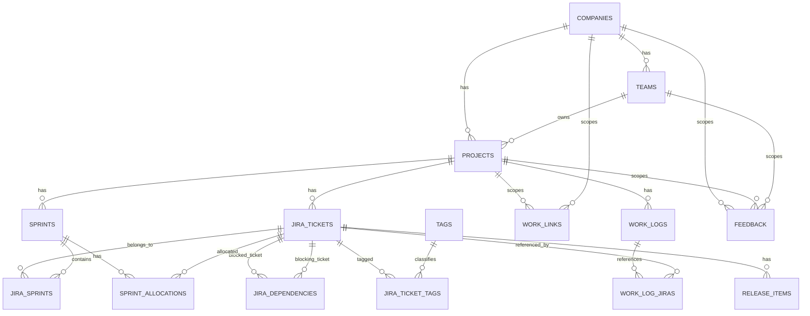

# Work Tracker — SQL Relational Schema Reference

**Version:** 2026-09-02  
**Target:** PostgreSQL-style relational design  
**Purpose:** SQL equivalent of the Notion Work Tracker, including normalized relations, joins, derived views, capacity calculation, Jira dependencies, tags, appraisal data, feedback/growth tracking, demo tracking, release-item tracking, and sprint allocation.

---

# 1. Relational design principles

The SQL model intentionally avoids storing values that can be derived by joins.

Examples:

- Work Log does **not** store Company/Team; they are derived through Project.
- Work Log does **not** store Jira Status/Sprint/Spillover Count; they are derived through Jira joins.
- Jira does **not** store `Spillover` or `Spillover Count`; they are derived from `jira_sprints`.
- Sprint does **not** store allocated Jira rows directly; they live in `sprint_allocations`.
- `sprint_allocations` has a unique constraint on `(sprint_id, jira_id)`, preventing the duplicate allocations that Notion allows.
- Release Item Jira Status/Sprints/Spillover Count are derived through joins; they are not duplicated in `release_items`.

---

# 2. ER diagram



---

# 3. Table summary

| Table | Purpose |
|---|---|
| `companies` | Company/client metadata |
| `teams` | Teams under companies |
| `projects` | Active/inactive projects |
| `sprints` | Sprint master and capacity inputs |
| `jira_tickets` | Jira ticket metadata |
| `jira_sprints` | Many-to-many Jira ↔ Sprint history |
| `jira_dependencies` | Self-referencing blocked-by relationships |
| `tags` | Jira tag catalog |
| `jira_ticket_tags` | Many-to-many Jira ↔ Tag |
| `work_logs` | Daily work entries |
| `work_log_jiras` | Many-to-many Work Log ↔ Jira |
| `work_links` | Jira base URL, timesheet, dashboard, rota, etc. |
| `sprint_allocations` | Planned days for one Jira in one Sprint |
| `release_items` | Component/version-level release records related to a Jira |
| `feedback` | Feedback received from managers/leads/colleagues/clients, including context and follow-up |

---

# 4. PostgreSQL DDL

> Requires `pgcrypto` for `gen_random_uuid()`.

```sql
CREATE EXTENSION IF NOT EXISTS pgcrypto;
```

## 4.1 Companies

```sql
CREATE TABLE companies (
    id              uuid PRIMARY KEY DEFAULT gen_random_uuid(),
    name            text NOT NULL UNIQUE,
    category        text NOT NULL,
    division        text,
    product         text,
    active          boolean NOT NULL DEFAULT true,
    created_at      timestamptz NOT NULL DEFAULT now(),
    updated_at      timestamptz NOT NULL DEFAULT now(),

    CHECK (category IN ('Office Work', 'Freelancing'))
);
```

## 4.2 Teams

```sql
CREATE TABLE teams (
    id              uuid PRIMARY KEY DEFAULT gen_random_uuid(),
    company_id      uuid NOT NULL REFERENCES companies(id),
    name            text NOT NULL,
    active          boolean NOT NULL DEFAULT true,
    created_at      timestamptz NOT NULL DEFAULT now(),
    updated_at      timestamptz NOT NULL DEFAULT now(),

    UNIQUE (company_id, name)
);
```

## 4.3 Projects

```sql
CREATE TABLE projects (
    id              uuid PRIMARY KEY DEFAULT gen_random_uuid(),
    company_id      uuid NOT NULL REFERENCES companies(id),
    team_id         uuid REFERENCES teams(id),
    name            text NOT NULL,
    active          boolean NOT NULL DEFAULT true,
    created_at      timestamptz NOT NULL DEFAULT now(),
    updated_at      timestamptz NOT NULL DEFAULT now(),

    UNIQUE (company_id, name)
);
```

## 4.4 Sprints

Weekdays use ISO numbering:

```text
1 = Monday
2 = Tuesday
3 = Wednesday
4 = Thursday
5 = Friday
6 = Saturday
7 = Sunday
```

```sql
CREATE TABLE sprints (
    id                  uuid PRIMARY KEY DEFAULT gen_random_uuid(),
    project_id          uuid NOT NULL REFERENCES projects(id),
    name                text NOT NULL,
    start_date          date NOT NULL,
    end_date            date NOT NULL,
    active              boolean NOT NULL DEFAULT false,
    week_off_1          smallint,
    week_off_2          smallint,
    planned_leave_days  numeric(6,2) NOT NULL DEFAULT 0,
    holiday_days        numeric(6,2) NOT NULL DEFAULT 0,
    created_at          timestamptz NOT NULL DEFAULT now(),
    updated_at          timestamptz NOT NULL DEFAULT now(),

    UNIQUE (project_id, name),

    CHECK (end_date >= start_date),
    CHECK (week_off_1 IS NULL OR week_off_1 BETWEEN 1 AND 7),
    CHECK (week_off_2 IS NULL OR week_off_2 BETWEEN 1 AND 7),
    CHECK (planned_leave_days >= 0),
    CHECK (holiday_days >= 0)
);
```

### Enforce one active Sprint per Project

```sql
CREATE UNIQUE INDEX uq_one_active_sprint_per_project
ON sprints(project_id)
WHERE active = true;
```

## 4.5 Jira tickets

External dependency Jira tickets may have no `project_id`.

```sql
CREATE TABLE jira_tickets (
    id                  uuid PRIMARY KEY DEFAULT gen_random_uuid(),
    jira_key            text NOT NULL UNIQUE,
    summary             text,
    project_id          uuid REFERENCES projects(id),
    status              text NOT NULL DEFAULT 'Not started',
    spillover_reason    text,
    appraisal           boolean NOT NULL DEFAULT false,
    demo_required       boolean NOT NULL DEFAULT false,
    demoed_date         date,
    demo_notes          text,
    created_at          timestamptz NOT NULL DEFAULT now(),
    updated_at          timestamptz NOT NULL DEFAULT now(),

    CHECK (status IN ('Not started', 'In progress', 'Blocked', 'Done'))
);
```

## 4.6 Jira ↔ Sprint history

```sql
CREATE TABLE jira_sprints (
    jira_id             uuid NOT NULL REFERENCES jira_tickets(id) ON DELETE CASCADE,
    sprint_id           uuid NOT NULL REFERENCES sprints(id) ON DELETE CASCADE,
    created_at          timestamptz NOT NULL DEFAULT now(),

    PRIMARY KEY (jira_id, sprint_id)
);
```

## 4.7 Jira dependencies

```sql
CREATE TABLE jira_dependencies (
    jira_id             uuid NOT NULL REFERENCES jira_tickets(id) ON DELETE CASCADE,
    blocked_by_jira_id  uuid NOT NULL REFERENCES jira_tickets(id) ON DELETE CASCADE,
    created_at          timestamptz NOT NULL DEFAULT now(),

    PRIMARY KEY (jira_id, blocked_by_jira_id),
    CHECK (jira_id <> blocked_by_jira_id)
);
```

## 4.8 Tags

```sql
CREATE TABLE tags (
    id          uuid PRIMARY KEY DEFAULT gen_random_uuid(),
    name        text NOT NULL UNIQUE
);
```

Seed examples:

```sql
INSERT INTO tags(name) VALUES
('Sprint Work'),
('Dependency'),
('DevOps'),
('DB Team'),
('Platform / Infra'),
('Prod Support'),
('Non-prod Support'),
('Editorial Team')
ON CONFLICT DO NOTHING;
```

### Jira ↔ Tag

```sql
CREATE TABLE jira_ticket_tags (
    jira_id     uuid NOT NULL REFERENCES jira_tickets(id) ON DELETE CASCADE,
    tag_id      uuid NOT NULL REFERENCES tags(id) ON DELETE CASCADE,

    PRIMARY KEY (jira_id, tag_id)
);
```

## 4.9 Work Logs

Project is nullable because Grooming/Learning entries may not belong to a project.

```sql
CREATE TABLE work_logs (
    id              uuid PRIMARY KEY DEFAULT gen_random_uuid(),
    update_title    text NOT NULL,
    work_date       date NOT NULL DEFAULT CURRENT_DATE,
    category        text NOT NULL,
    project_id      uuid REFERENCES projects(id),
    work_type       text NOT NULL,
    comment         text,
    went_wrong      text,
    work_mode       text DEFAULT 'WFO (Office)',
    appraisal       boolean NOT NULL DEFAULT false,
    created_at      timestamptz NOT NULL DEFAULT now(),
    updated_at      timestamptz NOT NULL DEFAULT now(),

    CHECK (category IN ('Office Work', 'Freelancing', 'Grooming'))
);
```

`work_date DEFAULT CURRENT_DATE` is the SQL equivalent of the Notion `Default Work Log` template using `Today — Date when duplicated`. `work_mode DEFAULT 'WFO (Office)'` mirrors the same template's Work Mode default.

### Work Log ↔ Jira

```sql
CREATE TABLE work_log_jiras (
    work_log_id     uuid NOT NULL REFERENCES work_logs(id) ON DELETE CASCADE,
    jira_id         uuid NOT NULL REFERENCES jira_tickets(id) ON DELETE CASCADE,

    PRIMARY KEY (work_log_id, jira_id)
);
```

## 4.10 Work Links

```sql
CREATE TABLE work_links (
    id              uuid PRIMARY KEY DEFAULT gen_random_uuid(),
    name            text NOT NULL,
    link_type       text NOT NULL,
    url             text NOT NULL,
    company_id      uuid REFERENCES companies(id),
    project_id      uuid REFERENCES projects(id),
    notes           text,
    active          boolean NOT NULL DEFAULT true,
    created_at      timestamptz NOT NULL DEFAULT now(),
    updated_at      timestamptz NOT NULL DEFAULT now()
);
```

## 4.11 Sprint Allocations

There is no Allocation-title column in SQL because SQL rows do not require a page title.

```sql
CREATE TABLE sprint_allocations (
    id              uuid PRIMARY KEY DEFAULT gen_random_uuid(),
    sprint_id       uuid NOT NULL REFERENCES sprints(id) ON DELETE CASCADE,
    jira_id         uuid NOT NULL REFERENCES jira_tickets(id) ON DELETE CASCADE,
    planned_days    numeric(6,2) NOT NULL,
    notes           text,
    created_at      timestamptz NOT NULL DEFAULT now(),
    updated_at      timestamptz NOT NULL DEFAULT now(),

    CHECK (planned_days >= 0),

    UNIQUE (sprint_id, jira_id)
);
```

The unique constraint prevents duplicate allocation of the same Jira within the same Sprint.

## 4.12 Release Items

One row represents one component/version release entry for one Jira. A Jira may have many rows because multiple micro-frontends/micro-apps can be released from the same ticket.

The Notion `Release Items` title is not stored in SQL because relational rows do not require a page title.

TAR information is intentionally kept in `notes`; there is no dedicated TAR column.

```sql
CREATE TABLE release_items (
    id                       uuid PRIMARY KEY DEFAULT gen_random_uuid(),
    jira_id                  uuid NOT NULL REFERENCES jira_tickets(id) ON DELETE CASCADE,
    component_name           text,
    deployment_type          text,
    version_number           text,
    branch                   text,
    formal_announced_date    date,
    confirmed_release_date   date,
    notes                    text,
    created_at               timestamptz NOT NULL DEFAULT now(),
    updated_at               timestamptz NOT NULL DEFAULT now(),

    CHECK (
        deployment_type IS NULL
        OR deployment_type IN ('Backstage', 'Spinnaker', 'Docker Promotion', 'Other')
    ),
    CHECK (
        confirmed_release_date IS NULL
        OR formal_announced_date IS NOT NULL
    )
);
```

A release item can initially be created as a draft containing only `jira_id`, matching the Notion `Add Release Item` button. Component/version-specific fields can be filled afterward.

Recommended duplicate guard once component and version are known:

```sql
CREATE UNIQUE INDEX uq_release_item_jira_component_version
ON release_items(jira_id, component_name, version_number)
WHERE component_name IS NOT NULL
  AND version_number IS NOT NULL;
```

This still allows multiple components under the same Jira while preventing accidental duplicate rows for the same Jira/component/version combination.

---


## 4.13 Feedback

Feedback is intentionally separate from Work Log. A row records feedback received from another person and may optionally be scoped to a company, project, and team.

```sql
CREATE TABLE feedback (
    id                  uuid PRIMARY KEY DEFAULT gen_random_uuid(),
    feedback_title      text NOT NULL,
    feedback_date       date NOT NULL DEFAULT CURRENT_DATE,
    feedback_from       text,
    person_type         text,
    context             text,
    feedback_type       text,
    company_id          uuid REFERENCES companies(id),
    project_id          uuid REFERENCES projects(id),
    team_id             uuid REFERENCES teams(id),
    details             text,
    action_follow_up    text,
    created_at          timestamptz NOT NULL DEFAULT now(),
    updated_at          timestamptz NOT NULL DEFAULT now(),

    CHECK (
        person_type IS NULL
        OR person_type IN (
            'Manager',
            'Team Lead',
            'Tech Lead',
            'Colleague',
            'Client',
            'Other'
        )
    ),

    CHECK (
        context IS NULL
        OR context IN (
            'Weekly Update',
            'Appraisal',
            'Half-Yearly Appraisal',
            'Monthly Review',
            '1:1',
            'Ad Hoc',
            'Project Review',
            'Client Feedback',
            'Other'
        )
    ),

    CHECK (
        feedback_type IS NULL
        OR feedback_type IN (
            'Positive',
            'Improvement',
            'Suggestion',
            'Negative'
        )
    )
);
```

`Company`, `Project`, and `Team` remain separate relations because the user may want to retain exactly where the feedback occurred. `Office Work` / `Freelancing` remains derived from `companies.category` rather than being duplicated in `feedback`.

---

# 5. Capacity calculation

## Working-day function

```sql
CREATE OR REPLACE FUNCTION working_days_between(
    p_start_date date,
    p_end_date date,
    p_week_off_1 smallint,
    p_week_off_2 smallint
)
RETURNS integer
LANGUAGE sql
IMMUTABLE
AS $$
    SELECT COUNT(*)::integer
    FROM generate_series(
        p_start_date,
        p_end_date,
        interval '1 day'
    ) AS d(day_value)
    WHERE
        (p_week_off_1 IS NULL
         OR EXTRACT(ISODOW FROM d.day_value)::integer <> p_week_off_1)
      AND
        (p_week_off_2 IS NULL
         OR EXTRACT(ISODOW FROM d.day_value)::integer <> p_week_off_2);
$$;
```

---

# 6. Derived views

## 6.1 Jira summary

```sql
CREATE VIEW v_jira_summary AS
SELECT
    j.id,
    j.jira_key,
    j.summary,
    j.project_id,
    j.status,
    j.spillover_reason,
    j.appraisal,
    j.demo_required,
    j.demoed_date,
    j.demo_notes,

    COUNT(js.sprint_id) AS sprint_count,
    (COUNT(js.sprint_id) > 1) AS spillover,
    GREATEST(COUNT(js.sprint_id) - 1, 0) AS spillover_count,
    COALESCE(BOOL_OR(s.active), false) AS in_active_sprint

FROM jira_tickets j
LEFT JOIN jira_sprints js
       ON js.jira_id = j.id
LEFT JOIN sprints s
       ON s.id = js.sprint_id
GROUP BY
    j.id,
    j.jira_key,
    j.summary,
    j.project_id,
    j.status,
    j.spillover_reason,
    j.appraisal,
    j.demo_required,
    j.demoed_date,
    j.demo_notes;
```

## 6.2 Sprint bandwidth view

```sql
CREATE VIEW v_sprint_capacity AS
WITH allocation_totals AS (
    SELECT
        sprint_id,
        COALESCE(SUM(planned_days), 0) AS allocated_days
    FROM sprint_allocations
    GROUP BY sprint_id
)
SELECT
    s.id,
    s.project_id,
    s.name,
    s.start_date,
    s.end_date,
    s.active,
    s.week_off_1,
    s.week_off_2,
    s.planned_leave_days,
    s.holiday_days,

    working_days_between(
        s.start_date,
        s.end_date,
        s.week_off_1,
        s.week_off_2
    ) AS capacity_days,

    GREATEST(
        working_days_between(
            s.start_date,
            s.end_date,
            s.week_off_1,
            s.week_off_2
        )
        - s.planned_leave_days
        - s.holiday_days,
        0
    ) AS available_days,

    COALESCE(a.allocated_days, 0) AS allocated_days,

    GREATEST(
        working_days_between(
            s.start_date,
            s.end_date,
            s.week_off_1,
            s.week_off_2
        )
        - s.planned_leave_days
        - s.holiday_days,
        0
    )
    - COALESCE(a.allocated_days, 0) AS remaining_days

FROM sprints s
LEFT JOIN allocation_totals a
       ON a.sprint_id = s.id;
```

## 6.3 Work Log enriched view

```sql
CREATE VIEW v_work_log_enriched AS
SELECT
    wl.id,
    wl.update_title,
    wl.work_date,
    wl.category,
    wl.work_type,
    wl.comment,
    wl.went_wrong,
    wl.work_mode,
    wl.appraisal,

    p.id AS project_id,
    p.name AS project_name,

    c.id AS company_id,
    c.name AS company_name,

    t.id AS team_id,
    t.name AS team_name,

    COALESCE(
        jsonb_agg(
            DISTINCT jsonb_build_object(
                'jiraKey', j.jira_key,
                'status', j.status,
                'spilloverCount', vj.spillover_count
            )
        ) FILTER (WHERE j.id IS NOT NULL),
        '[]'::jsonb
    ) AS jiras

FROM work_logs wl
LEFT JOIN projects p
       ON p.id = wl.project_id
LEFT JOIN companies c
       ON c.id = p.company_id
LEFT JOIN teams t
       ON t.id = p.team_id
LEFT JOIN work_log_jiras wlj
       ON wlj.work_log_id = wl.id
LEFT JOIN jira_tickets j
       ON j.id = wlj.jira_id
LEFT JOIN v_jira_summary vj
       ON vj.id = j.id

GROUP BY
    wl.id,
    p.id,
    p.name,
    c.id,
    c.name,
    t.id,
    t.name;
```

## 6.4 Work Log Appraisal view

Equivalent of Notion `Work Log → Appraisal`.

```sql
CREATE VIEW v_work_log_appraisal AS
SELECT *
FROM v_work_log_enriched
WHERE appraisal = true;
```

## 6.5 Jira filtered views

These correspond directly to the Notion JIRA views.

```sql
CREATE VIEW v_jira_active_sprint AS
SELECT *
FROM v_jira_summary
WHERE in_active_sprint = true;

CREATE VIEW v_jira_blocked AS
SELECT *
FROM v_jira_summary
WHERE in_active_sprint = true
  AND status = 'Blocked';

CREATE VIEW v_jira_spillovers AS
SELECT *
FROM v_jira_summary
WHERE in_active_sprint = true
  AND spillover = true;

CREATE VIEW v_jira_appraisal AS
SELECT *
FROM v_jira_summary
WHERE appraisal = true;

CREATE VIEW v_jira_demo_pending AS
SELECT *
FROM v_jira_summary
WHERE demo_required = true
  AND demoed_date IS NULL;

CREATE VIEW v_jira_demoed AS
SELECT *
FROM v_jira_summary
WHERE demoed_date IS NOT NULL;
```

## 6.6 Current Sprint Allocation view

Equivalent of Notion `Sprint Allocation → Current Sprint`, where the `Sprint Active` rollup is checked.

```sql
CREATE VIEW v_sprint_allocations_current AS
SELECT
    sa.id,
    sa.sprint_id,
    s.name AS sprint_name,
    sa.jira_id,
    j.jira_key,
    j.summary AS jira_summary,
    sa.planned_days,
    sa.notes
FROM sprint_allocations sa
JOIN sprints s
  ON s.id = sa.sprint_id
JOIN jira_tickets j
  ON j.id = sa.jira_id
WHERE s.active = true;
```

## 6.7 Release Items enriched view

Equivalent of the Release Items `All` view plus the JIRA-derived Rollups (`JIRA Status`, `Sprints`, `Spillover Count`).

```sql
CREATE VIEW v_release_items_enriched AS
SELECT
    r.id,
    r.jira_id,
    j.jira_key,
    j.summary AS jira_summary,
    j.status AS jira_status,

    r.component_name,
    r.deployment_type,
    r.version_number,
    r.branch,
    r.formal_announced_date,
    r.confirmed_release_date,
    r.notes,

    vj.spillover,
    vj.spillover_count,

    COALESCE(
        (
            SELECT array_agg(s.name ORDER BY s.start_date)
            FROM jira_sprints js
            JOIN sprints s
              ON s.id = js.sprint_id
            WHERE js.jira_id = r.jira_id
        ),
        ARRAY[]::text[]
    ) AS sprints,

    r.created_at,
    r.updated_at

FROM release_items r
JOIN jira_tickets j
  ON j.id = r.jira_id
JOIN v_jira_summary vj
  ON vj.id = r.jira_id;
```

## 6.8 Release Items filtered views

These correspond directly to the Notion Release Items views.

```sql
CREATE VIEW v_release_pending_confirmation AS
SELECT *
FROM v_release_items_enriched
WHERE formal_announced_date IS NOT NULL
  AND confirmed_release_date IS NULL;

CREATE VIEW v_release_confirmed AS
SELECT *
FROM v_release_items_enriched
WHERE confirmed_release_date IS NOT NULL;

CREATE VIEW v_release_not_announced AS
SELECT *
FROM v_release_items_enriched
WHERE formal_announced_date IS NULL;
```

---


## 6.9 Feedback enriched and filtered views

The enriched view exposes organization names without duplicating them in the base table.

```sql
CREATE VIEW v_feedback_enriched AS
SELECT
    f.id,
    f.feedback_title,
    f.feedback_date,
    f.feedback_from,
    f.person_type,
    f.context,
    f.feedback_type,
    f.details,
    f.action_follow_up,

    c.id AS company_id,
    c.name AS company_name,
    c.category AS company_category,

    p.id AS project_id,
    p.name AS project_name,

    t.id AS team_id,
    t.name AS team_name,

    f.created_at,
    f.updated_at

FROM feedback f
LEFT JOIN companies c
       ON c.id = f.company_id
LEFT JOIN projects p
       ON p.id = f.project_id
LEFT JOIN teams t
       ON t.id = f.team_id;
```

```sql
CREATE VIEW v_feedback_positive AS
SELECT *
FROM v_feedback_enriched
WHERE feedback_type = 'Positive';

CREATE VIEW v_feedback_improvement AS
SELECT *
FROM v_feedback_enriched
WHERE feedback_type IN ('Improvement', 'Suggestion', 'Negative');

CREATE VIEW v_feedback_appraisal AS
SELECT *
FROM v_feedback_enriched
WHERE context IN ('Appraisal', 'Half-Yearly Appraisal');
```

---

# 7. Common joins and queries

## Current active Sprint

```sql
SELECT *
FROM v_sprint_capacity
WHERE active = true;
```

## Active Sprint Jira tickets

```sql
SELECT DISTINCT j.*
FROM jira_tickets j
JOIN jira_sprints js ON js.jira_id = j.id
JOIN sprints s ON s.id = js.sprint_id
WHERE s.active = true
ORDER BY j.jira_key;
```

## Current Sprint blocked Jira tickets

```sql
SELECT DISTINCT j.*
FROM jira_tickets j
JOIN jira_sprints js ON js.jira_id = j.id
JOIN sprints s ON s.id = js.sprint_id
WHERE s.active = true
  AND j.status = 'Blocked';
```

## Current Sprint spillovers

```sql
SELECT v.*
FROM v_jira_summary v
WHERE v.in_active_sprint = true
  AND v.spillover = true
ORDER BY v.spillover_count DESC;
```

## Jira sprint history

```sql
SELECT
    j.jira_key,
    s.name AS sprint,
    s.start_date,
    s.end_date,
    s.active
FROM jira_tickets j
JOIN jira_sprints js ON js.jira_id = j.id
JOIN sprints s ON s.id = js.sprint_id
WHERE j.jira_key = 'CRI-1234'
ORDER BY s.start_date;
```

## Jira allocation history

```sql
SELECT
    j.jira_key,
    s.name AS sprint,
    sa.planned_days,
    sa.notes
FROM sprint_allocations sa
JOIN jira_tickets j ON j.id = sa.jira_id
JOIN sprints s ON s.id = sa.sprint_id
WHERE j.jira_key = 'CRI-1234'
ORDER BY s.start_date;
```

## Current Sprint allocations

```sql
SELECT
    s.name AS sprint,
    j.jira_key,
    j.summary,
    sa.planned_days,
    vj.spillover
FROM sprint_allocations sa
JOIN sprints s ON s.id = sa.sprint_id
JOIN jira_tickets j ON j.id = sa.jira_id
JOIN v_jira_summary vj ON vj.id = j.id
WHERE s.active = true
ORDER BY j.jira_key;
```

## Dependency tickets

```sql
SELECT DISTINCT
    j.jira_key,
    j.summary,
    j.status
FROM jira_tickets j
JOIN jira_ticket_tags jtt ON jtt.jira_id = j.id
JOIN tags t ON t.id = jtt.tag_id
WHERE t.name = 'Dependency';
```

## Blocked Jira with dependency details

```sql
SELECT
    blocked.jira_key AS blocked_jira,
    blocked.summary AS blocked_summary,
    dependency.jira_key AS blocked_by_jira,
    dependency.summary AS dependency_summary,
    dependency.status AS dependency_status
FROM jira_dependencies jd
JOIN jira_tickets blocked ON blocked.id = jd.jira_id
JOIN jira_tickets dependency ON dependency.id = jd.blocked_by_jira_id
ORDER BY blocked.jira_key;
```

## Work Log entries for one Jira

```sql
SELECT
    wl.work_date,
    wl.update_title,
    wl.comment,
    wl.went_wrong,
    wl.appraisal
FROM work_logs wl
JOIN work_log_jiras wlj ON wlj.work_log_id = wl.id
JOIN jira_tickets j ON j.id = wlj.jira_id
WHERE j.jira_key = 'CRI-1234'
ORDER BY wl.work_date;
```

## Demo Pending Jira tickets

```sql
SELECT *
FROM v_jira_demo_pending
ORDER BY jira_key;
```

## Demoed Jira tickets

```sql
SELECT *
FROM v_jira_demoed
ORDER BY demoed_date DESC, jira_key;
```

## Pending release confirmation

```sql
SELECT *
FROM v_release_pending_confirmation
ORDER BY formal_announced_date DESC, jira_key, component_name;
```

## Confirmed releases

```sql
SELECT *
FROM v_release_confirmed
ORDER BY confirmed_release_date DESC, jira_key, component_name;
```

## Not-announced release items

```sql
SELECT *
FROM v_release_not_announced
ORDER BY jira_key, component_name;
```

---


## Feedback for appraisal/review

```sql
SELECT *
FROM v_feedback_appraisal
ORDER BY feedback_date DESC;
```

## Feedback requiring improvement/follow-up review

```sql
SELECT *
FROM v_feedback_improvement
ORDER BY feedback_date DESC;
```

---

# 8. Notion view equivalence

This is the canonical mapping between Notion database views and SQL read models/application filters.

| Notion database | Notion view | Notion filter | SQL equivalent |
|---|---|---|---|
| Work Log | `All` | No filter | `v_work_log_enriched` |
| Work Log | `Appraisal` | `Appraisal = checked` | `v_work_log_appraisal` |
| Feedback | `All` | No filter | `v_feedback_enriched` |
| Feedback | `Positive` | `Feedback Type = Positive` | `v_feedback_positive` |
| Feedback | `Improvement` | `Feedback Type = Improvement OR Suggestion OR Negative` | `v_feedback_improvement` |
| Feedback | `Appraisal` | `Context = Appraisal OR Half-Yearly Appraisal` | `v_feedback_appraisal` |
| Sprints | `All` | No filter | `v_sprint_capacity` |
| Sprints | `Capacity` | No row filter; capacity-focused columns | `v_sprint_capacity` |
| JIRAs | `All` | No filter | `v_jira_summary` |
| JIRAs | `Active Sprint` | `In Active Sprint = checked` | `v_jira_active_sprint` |
| JIRAs | `Blocked` | Active sprint + `Status = Blocked` | `v_jira_blocked` |
| JIRAs | `Spillovers` | Active sprint + `Spillover = checked` | `v_jira_spillovers` |
| JIRAs | `Appraisal` | `Appraisal = checked` | `v_jira_appraisal` |
| JIRAs | `Demo Pending` | `Demo Required = checked AND Demoed Date is empty` | `v_jira_demo_pending` |
| JIRAs | `Demoed` | `Demoed Date is not empty` | `v_jira_demoed` |
| Sprint Allocation | `All` | No filter | `sprint_allocations` |
| Sprint Allocation | `Current Sprint` | `Sprint Active = checked` | `v_sprint_allocations_current` |
| Release Items | `All` | No filter | `v_release_items_enriched` |
| Release Items | `Pending Confirmation` | Formal date present + confirmed date empty | `v_release_pending_confirmation` |
| Release Items | `Confirmed` | Confirmed date present | `v_release_confirmed` |
| Release Items | `Not Announced` | Formal date empty | `v_release_not_announced` |
| Work Links | default table | No filter | `work_links` |

For an application's API, these SQL views can be queried directly or treated as the query definitions behind corresponding endpoints.

---

# 9. Appraisal query

Appraisal preparation can combine appraisal-marked Jira and Work Log records with feedback captured in appraisal/half-yearly appraisal contexts.

```sql
SELECT
    'JIRA' AS source_type,
    j.id AS source_id,
    NULL::date AS work_date,
    j.jira_key AS title,
    j.summary AS details
FROM jira_tickets j
WHERE j.appraisal = true

UNION ALL

SELECT
    'WORK_LOG' AS source_type,
    wl.id AS source_id,
    wl.work_date,
    wl.update_title AS title,
    wl.comment AS details
FROM work_logs wl
WHERE wl.appraisal = true

UNION ALL

SELECT
    'FEEDBACK' AS source_type,
    f.id AS source_id,
    f.feedback_date AS work_date,
    f.feedback_title AS title,
    f.details
FROM feedback f
WHERE f.context IN ('Appraisal', 'Half-Yearly Appraisal')

ORDER BY work_date NULLS LAST;
```

---

# 10. Active Jira base URL

```sql
SELECT wl.url
FROM work_links wl
WHERE wl.link_type = 'JIRA Base URL'
  AND wl.active = true
ORDER BY wl.updated_at DESC
LIMIT 1;
```

Application logic:

```text
jira_url = base_url + '/browse/' + jira_key
```

---

# 11. Duplicate allocation prevention

SQL prevents duplicate Sprint Allocation rows directly:

```sql
UNIQUE (sprint_id, jira_id)
```

Trying to allocate the same Jira twice in the same sprint should be surfaced by the API as something like:

```text
HTTP 409 Conflict
JIRA_ALREADY_ALLOCATED
```

---

# 12. New sprint workflow

## Deactivate old sprint

```sql
UPDATE sprints
SET active = false,
    updated_at = now()
WHERE project_id = :project_id
  AND active = true;
```

## Activate new sprint

```sql
UPDATE sprints
SET active = true,
    updated_at = now()
WHERE id = :new_sprint_id;
```

## Add Jira to new sprint

```sql
INSERT INTO jira_sprints(jira_id, sprint_id)
VALUES (:jira_id, :new_sprint_id)
ON CONFLICT DO NOTHING;
```

For spillovers, keep the old row and add the new row.

## Allocate effort

```sql
INSERT INTO sprint_allocations(
    sprint_id,
    jira_id,
    planned_days
)
VALUES (
    :sprint_id,
    :jira_id,
    :planned_days
);
```

## Add Release Item

The Notion `Add Release Item` button creates a draft Release Item linked to the current Jira. SQL/application equivalent:

```sql
INSERT INTO release_items (jira_id)
VALUES (:jira_id)
RETURNING *;
```

The client then fills `component_name`, `deployment_type`, `version_number`, `branch`, release dates, and `notes`.

Example update:

```sql
UPDATE release_items
SET component_name = :component_name,
    deployment_type = :deployment_type,
    version_number = :version_number,
    branch = :branch,
    formal_announced_date = :formal_announced_date,
    confirmed_release_date = :confirmed_release_date,
    notes = :notes,
    updated_at = now()
WHERE id = :release_item_id;
```

One Jira may have multiple Release Items. Do not reuse Sprint Allocation's uniqueness rule here; only the optional Jira/component/version duplicate guard applies.

---

# 13. Notion → SQL mapping

| Notion concept | SQL equivalent |
|---|---|
| Relation Company → Projects | `projects.company_id` FK |
| Relation Team → Projects | `projects.team_id` FK |
| Jira `Sprints` relation | `jira_sprints` join table |
| Work Log `JIRAs` relation | `work_log_jiras` join table |
| Jira `Blocked By` | `jira_dependencies` self-join table |
| Jira `Tags` multi-select | `tags` + `jira_ticket_tags` |
| Jira `Demo Required` | `jira_tickets.demo_required` |
| Jira `Demoed Date` | `jira_tickets.demoed_date` |
| Jira `Demo Notes` | `jira_tickets.demo_notes` |
| Jira `Release Items` reverse relation | Query `release_items.jira_id`; no duplicated array on Jira |
| Jira `Add Release Item` button | Application action: `INSERT INTO release_items(jira_id)` |
| Sprint `Allocations` reverse relation | `sprint_allocations.sprint_id` |
| Sprint Allocation `JIRA` relation | `sprint_allocations.jira_id` |
| Rollup `Company` in Work Log | JOIN Work Log → Project → Company |
| Rollup `Team` in Work Log | JOIN Work Log → Project → Team |
| Rollup Jira Status | JOIN via `work_log_jiras` |
| Rollup Sprint names | JOIN `jira_sprints` |
| Jira Spillover formula | `COUNT(jira_sprints) > 1` |
| Jira Spillover Count | `GREATEST(COUNT(*) - 1, 0)` |
| Jira In Active Sprint | `BOOL_OR(sprints.active)` |
| Sprint Allocated Days | `SUM(sprint_allocations.planned_days)` |
| Sprint Remaining Days | Available Days − Allocated Days |
| Sprint Allocation Title | Not needed in SQL |
| Release Items Title | Not needed in SQL |
| Release Items `JIRAs` relation | `release_items.jira_id` FK |
| Release Items `JIRA Status` rollup | JOIN `release_items → jira_tickets.status` |
| Release Items `Sprints` rollup | JOIN through `jira_sprints` |
| Release Items `Spillover Count` rollup | JOIN `v_jira_summary.spillover_count` |
| Work Log template `Today` | `work_logs.work_date DEFAULT CURRENT_DATE` |
| Work Log template `WFO (Office)` | `work_logs.work_mode DEFAULT 'WFO (Office)'` |
| Feedback `Company` relation | `feedback.company_id` FK |
| Feedback `Project` relation | `feedback.project_id` FK |
| Feedback `Team` relation | `feedback.team_id` FK |
| Feedback company category | JOIN `feedback → companies.category`; not duplicated |
| Feedback views | `v_feedback_enriched`, `v_feedback_positive`, `v_feedback_improvement`, `v_feedback_appraisal` |
| Notion views | Named SQL views / application filters listed in section 8 |

---

# 14. Recommended indexes

```sql
CREATE INDEX idx_teams_company ON teams(company_id);
CREATE INDEX idx_projects_company ON projects(company_id);
CREATE INDEX idx_projects_team ON projects(team_id);
CREATE INDEX idx_sprints_project ON sprints(project_id);
CREATE INDEX idx_sprints_active ON sprints(active);
CREATE INDEX idx_jira_project ON jira_tickets(project_id);
CREATE INDEX idx_jira_status ON jira_tickets(status);
CREATE INDEX idx_jira_sprints_sprint ON jira_sprints(sprint_id, jira_id);
CREATE INDEX idx_work_logs_date ON work_logs(work_date);
CREATE INDEX idx_work_logs_project ON work_logs(project_id);
CREATE INDEX idx_work_log_jiras_jira ON work_log_jiras(jira_id, work_log_id);
CREATE INDEX idx_sprint_allocations_sprint ON sprint_allocations(sprint_id);
CREATE INDEX idx_sprint_allocations_jira ON sprint_allocations(jira_id);
CREATE INDEX idx_work_links_active_type ON work_links(link_type, active);
CREATE INDEX idx_jira_demo_pending ON jira_tickets(demo_required, demoed_date);
CREATE INDEX idx_release_items_jira ON release_items(jira_id);
CREATE INDEX idx_release_items_formal_date ON release_items(formal_announced_date);
CREATE INDEX idx_release_items_confirmed_date ON release_items(confirmed_release_date);
CREATE INDEX idx_release_items_component ON release_items(component_name);
CREATE INDEX idx_feedback_date ON feedback(feedback_date DESC);
CREATE INDEX idx_feedback_company ON feedback(company_id);
CREATE INDEX idx_feedback_project ON feedback(project_id);
CREATE INDEX idx_feedback_team ON feedback(team_id);
CREATE INDEX idx_feedback_type ON feedback(feedback_type);
CREATE INDEX idx_feedback_context ON feedback(context);
```

---

# 15. SQL model advantages

The SQL version can enforce rules that Notion cannot reliably enforce:

1. **Only one active sprint per project**
   - partial unique index.

2. **Only one allocation for a Jira per sprint**
   - unique constraint `(sprint_id, jira_id)`.

3. **Foreign-key integrity**
   - no broken references.

4. **No duplicated Rollup storage**
   - values are derived through joins/views.

5. **Better history**
   - Jira sprint history and allocation history are explicit join tables.

6. **Release history without duplication**
   - one Jira can own many component/version Release Items while Jira status, sprint history, and spillover values remain derived.

7. **Feedback history is independent from daily work logs**
   - manager/lead/colleague/client feedback keeps its own context, type, organization scope, and follow-up while remaining queryable for appraisal preparation.

8. **Efficient API queries**
   - dashboard, appraisal, feedback, dependency, demo, release, and bandwidth endpoints can query optimized views.

---

# 16. Suggested application read models

Useful API/read models:

```text
GET /api/dashboard
GET /api/work-log
GET /api/feedback
GET /api/feedback/appraisal
GET /api/feedback/improvement
GET /api/jiras
GET /api/sprints/active
GET /api/sprint-allocations/current
GET /api/bandwidth
GET /api/appraisal
GET /api/jiras/demo-pending
GET /api/jiras/demoed
GET /api/release-items
GET /api/release-items/pending-confirmation
GET /api/release-items/confirmed
GET /api/release-items/not-announced
GET /api/config
```

Useful mutation endpoints/actions:

```text
POST  /api/feedback
PATCH /api/feedback/:feedbackId
POST  /api/jiras/:jiraId/release-items
PATCH /api/release-items/:releaseItemId
POST  /api/sprint-allocations
```

---

# 17. Final relational structure

```text
companies
   ├── teams
   │      └── feedback
   ├── projects
   │      ├── sprints
   │      │      └── sprint_allocations
   │      ├── jira_tickets
   │      │      ├── jira_sprints ────── sprints
   │      │      ├── jira_dependencies ─ jira_tickets
   │      │      ├── jira_ticket_tags ── tags
   │      │      └── release_items
   │      ├── work_logs
   │      │      └── work_log_jiras ──── jira_tickets
   │      ├── work_links
   │      └── feedback
   ├── work_links
   └── feedback
```

`feedback` can reference Company directly and optionally Project and Team; the repeated placement above represents those foreign-key paths, not duplicated feedback rows.

This SQL model preserves the behavior of the current Notion design—including Feedback & Growth, demo views, Release Items, release-status views, Work Log defaults, sprint bandwidth, and dependencies—while adding strong relational constraints and clean joins.