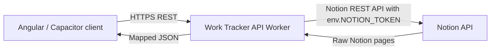

# Architecture

This document describes the current Work Tracker API architecture as a living technical reference.

## Current Flow

```text
Client
 -> Work Tracker API Worker
 -> Notion API
```



## Current Source Tree

```text
src/
├── index.ts
├── shared/
│   ├── env.ts
│   └── notion/
│       └── notion-client.ts
└── features/
    ├── jiras/
    │   ├── jira.mapper.ts
    │   ├── jira.filters.ts
    │   ├── jira.service.ts
    │   └── jira.routes.ts
    ├── sprints/
    │   ├── sprint.mapper.ts
    │   ├── sprint.filters.ts
    │   ├── sprint.service.ts
    │   └── sprint.routes.ts
    ├── sprint-allocations/
    │   ├── sprint-allocation.mapper.ts
    │   ├── sprint-allocation.filters.ts
    │   ├── sprint-allocation.service.ts
    │   └── sprint-allocation.routes.ts
    ├── companies/
    │   ├── company.mapper.ts
    │   ├── company.filters.ts
    │   ├── company.service.ts
    │   └── company.routes.ts
    ├── teams/
    │   ├── team.mapper.ts
    │   ├── team.filters.ts
    │   ├── team.service.ts
    │   └── team.routes.ts
    ├── projects/
    │   ├── project.mapper.ts
    │   ├── project.filters.ts
    │   ├── project.service.ts
    │   └── project.routes.ts
    └── work-logs/
        ├── work-log.mapper.ts
        ├── work-log.filters.ts
        ├── work-log.service.ts
        └── work-log.routes.ts
```

## Feature-Based Organization

Feature code lives under `src/features/<feature-name>/`. Each feature owns its routing, filtering, service orchestration, and mapping logic.

The currently implemented features are:

```text
src/features/jiras/
src/features/sprints/
src/features/sprint-allocations/
src/features/companies/
src/features/teams/
src/features/projects/
src/features/work-logs/
```

## Shared Code

`src/shared/env.ts` defines Cloudflare Worker bindings:

```ts
export interface Env {
  NOTION_TOKEN: string;
  JIRAS_DATA_SOURCE_ID: string;
  SPRINTS_DATA_SOURCE_ID: string;
  SPRINT_ALLOCATIONS_DATA_SOURCE_ID: string;
  PROJECTS_DATA_SOURCE_ID: string;
  COMPANIES_DATA_SOURCE_ID: string;
  TEAMS_DATA_SOURCE_ID: string;
  WORK_LOGS_DATA_SOURCE_ID: string;
}
```

`src/shared/notion/notion-client.ts` centralizes reusable Notion data-source querying:

- Notion API version
- request URL construction
- authorization header
- JSON body construction
- common HTTP error handling
- response typing for query results, `has_more`, and `next_cursor`

## Feature Module Pattern

Future features should follow this pattern:

```text
feature/
├── *.mapper.ts
├── *.filters.ts
├── *.service.ts
└── *.routes.ts
```

The pattern means:

| File Type | Responsibility |
| --- | --- |
| `*.routes.ts` | HTTP route matching and response handling. |
| `*.service.ts` | Feature orchestration and calls to shared clients. |
| `*.filters.ts` | External API filter definitions. |
| `*.mapper.ts` | Raw external data to API model mapping. |

Potential future modules include:

- `releases/`
- `feedback/`
- `work-links/`

Sprints, Sprint Allocations, Companies, Teams, Projects, and Work Logs are implemented. The other modules listed above are not implemented yet.

## Thin Entry Point

`src/index.ts` should remain small. Its job is to:

- parse the request URL
- return the root health response
- delegate feature routes
- return the normal 404 response when no route matches

Keeping the entry point thin prevents unrelated features from crowding into the Worker bootstrap file.

## Related Docs

- [JIRA API](jira-api.md)
- [Sprint API](sprint-api.md)
- [Company, Team, and Project API](company-team-project-api.md)
- [Work Log API](work-log-api.md)
- [Notion Integration](notion-integration.md)
- [Decisions](decisions.md)
