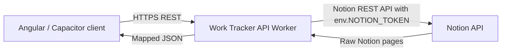

# Architecture

This document describes the current Work Tracker API architecture as a living technical reference.

## Current Flow

```text
Client
 -> Work Tracker API Worker
 -> Notion API
```



## Current Source Tree

```text
src/
├── index.ts
├── shared/
│   ├── env.ts
│   ├── auth/
│   │   ├── auth.constants.ts
│   │   ├── auth.crypto.ts
│   │   ├── auth.errors.ts
│   │   ├── auth.middleware.ts
│   │   ├── auth.password.ts
│   │   ├── auth.responses.ts
│   │   ├── auth.token.ts
│   │   └── auth.types.ts
│   └── notion/
│       └── notion-client.ts
└── features/
    ├── auth/
    │   └── auth.routes.ts
    ├── jiras/
    │   ├── jira.mapper.ts
    │   ├── jira.filters.ts
    │   ├── jira.service.ts
    │   └── jira.routes.ts
    ├── sprints/
    │   ├── sprint.mapper.ts
    │   ├── sprint.filters.ts
    │   ├── sprint.service.ts
    │   └── sprint.routes.ts
    ├── sprint-allocations/
    │   ├── sprint-allocation.mapper.ts
    │   ├── sprint-allocation.filters.ts
    │   ├── sprint-allocation.service.ts
    │   └── sprint-allocation.routes.ts
    ├── companies/
    │   ├── company.mapper.ts
    │   ├── company.filters.ts
    │   ├── company.service.ts
    │   └── company.routes.ts
    ├── teams/
    │   ├── team.mapper.ts
    │   ├── team.filters.ts
    │   ├── team.service.ts
    │   └── team.routes.ts
    ├── projects/
    │   ├── project.mapper.ts
    │   ├── project.filters.ts
    │   ├── project.service.ts
    │   └── project.routes.ts
    ├── dashboard/
    │   ├── dashboard.types.ts
    │   ├── dashboard.service.ts
    │   └── dashboard.routes.ts
    ├── work-logs/
    │   ├── work-log.mapper.ts
    │   ├── work-log.filters.ts
    │   ├── work-log.service.ts
    │   └── work-log.routes.ts
    ├── releases/
    │   ├── release.mapper.ts
    │   ├── release.filters.ts
    │   ├── release.service.ts
    │   └── release.routes.ts
    ├── feedback/
    │   ├── feedback.mapper.ts
    │   ├── feedback.filters.ts
    │   ├── feedback.service.ts
    │   └── feedback.routes.ts
    └── work-links/
        ├── work-link.mapper.ts
        ├── work-link.filters.ts
        ├── work-link.service.ts
        └── work-link.routes.ts
```

## Feature-Based Organization

Feature code lives under `src/features/<feature-name>/`. Each feature owns its routing, filtering, service orchestration, and mapping logic.

The currently implemented features are:

```text
src/features/jiras/
src/features/sprints/
src/features/sprint-allocations/
src/features/companies/
src/features/teams/
src/features/projects/
src/features/dashboard/
src/features/work-logs/
src/features/releases/
src/features/feedback/
src/features/work-links/
```

## Shared Code

`src/shared/env.ts` defines Cloudflare Worker bindings:

```ts
export interface Env {
  NOTION_TOKEN: string;
  AUTH_PASSWORD_HASH: string;
  AUTH_PASSWORD_SALT: string;
  AUTH_PASSWORD_ITERATIONS?: string;
  AUTH_JWT_SECRET: string;
  AUTH_TOKEN_TTL_SECONDS?: string;
  AUTH_RATE_LIMITER: RateLimitBinding;
  JIRAS_DATA_SOURCE_ID: string;
  SPRINTS_DATA_SOURCE_ID: string;
  SPRINT_ALLOCATIONS_DATA_SOURCE_ID: string;
  PROJECTS_DATA_SOURCE_ID: string;
  COMPANIES_DATA_SOURCE_ID: string;
  TEAMS_DATA_SOURCE_ID: string;
  WORK_LOGS_DATA_SOURCE_ID: string;
  RELEASE_ITEMS_DATA_SOURCE_ID: string;
  FEEDBACK_DATA_SOURCE_ID: string;
  WORK_LINKS_DATA_SOURCE_ID: string;
}
```

`src/shared/notion/notion-client.ts` centralizes reusable Notion data-source querying:

- Notion API version
- request URL construction
- authorization header
- JSON body construction
- common HTTP error handling
- response typing for query results, `has_more`, and `next_cursor`

`src/shared/relations/` centralizes optional shallow relation enrichment:

- include-parameter validation
- paginated catalog loading for Companies, Teams, Projects, Sprints, and JIRAs
- per-request in-memory maps
- resolved relation object types

`src/shared/auth/` centralizes API authentication:

- PBKDF2-SHA256 password verifier derivation and constant-time comparison
- HS256 JWT-compatible token creation and verification
- generic protected-route unauthorized responses
- public CORS preflight response headers

## Feature Module Pattern

Future features should follow this pattern:

```text
feature/
├── *.mapper.ts
├── *.filters.ts
├── *.service.ts
└── *.routes.ts
```

The pattern means:

| File Type | Responsibility |
| --- | --- |
| `*.routes.ts` | HTTP route matching and response handling. |
| `*.service.ts` | Feature orchestration and calls to shared clients. |
| `*.filters.ts` | External API filter definitions. |
| `*.mapper.ts` | Raw external data to API model mapping. |

Potential future modules include additional Dashboard APIs and write APIs.

Sprints, Sprint Allocations, Companies, Teams, Projects, Dashboard, Work Logs, Release Items, Feedback, and Work Links are implemented. Write APIs are not implemented yet.

## Thin Entry Point

`src/index.ts` should remain small. Its job is to:

- parse the request URL
- return the root health response
- handle public auth routes and CORS preflights
- authenticate protected `/api/*` routes before feature delegation
- delegate feature routes
- return the normal 404 response when no route matches

Keeping the entry point thin prevents unrelated features from crowding into the Worker bootstrap file.

## Related Docs

- [JIRA API](jira-api.md)
- [Authentication](authentication.md)
- [Sprint API](sprint-api.md)
- [Company, Team, and Project API](company-team-project-api.md)
- [Work Log API](work-log-api.md)
- [Release API](release-api.md)
- [Feedback API](feedback-api.md)
- [Work Links API](work-links-api.md)
- [Dashboard API](dashboard-api.md)
- [Relation Enrichment](relation-enrichment.md)
- [Notion Integration](notion-integration.md)
- [Decisions](decisions.md)
